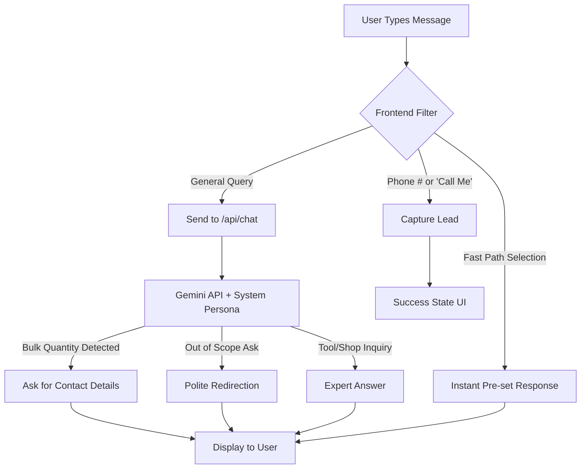

# Chatbot Architecture & Workflow: The Tool Shop HYD

This document outlines the design, features, and data flow of the intelligent sales and support chatbot integrated into The Tool Shop HYD's digital platform.

---

## 🤖 Overview
The chatbot is a hybrid system combining **Deterministic Logic (Fast Path)** and **Generative AI (Deep Intent)** to provide a responsive, professional, and sales-oriented user experience.

### Key Features
- **🚀 Fast Path Logic**: Instant responses for high-frequency queries (e.g., Power Tools, Bulk Quotes).
- **🧠 AI Personality**: Powered by Google Gemini, acting as "The Tool Shop HYD Assistant."
- **📞 Lead Capture**: Automatic detection of contact details and "call-back" requests.
- **📦 Bulk Intent Detection**: Intelligently identifies wholesale/project inquiries and pivots to lead generation.
- **🛠️ Domain Expertise**: Specialized knowledge in Bosch, DeWalt, and Makita power tools.
- **🛡️ Guardrails**: Restricts conversations to tools and shop services, avoiding unrelated topics.

---

## 🏗️ Technical Architecture

### 1. Frontend: `ChatWidget.jsx`
The UI layer handles user interaction, message state management, and immediate logic triggers.
- **State Management**: Tracks message history, open/close status, and lead capture state.
- **Regex Listeners**: Monitors for phone numbers and specific keywords to bypass AI when a direct conversion is possible.
- **Quick Actions**: Provides one-tap access to common user journeys.

### 2. Backend: `app/api/chat/route.js`
The intelligence layer that processes complex queries and manages the AI's persona.
- **Model**: `gemini-3.1-flash-lite-preview`
- **System Instructions**: Defines identity, catalog knowledge (Drills, Grinders, Saws), service details, and security protocols.
- **History Mapping**: Converts React state messages into the structured history required by the Gemini API.

---

## 🔄 Data Flow Map

---

## 📋 Logical Processing Steps

| Step | Component | Action |
| :--- | :--- | :--- |
| **Input** | `ChatWidget` | User inputs text or clicks a quick action button. |
| **Filter** | `ChatWidget` | Checks against `phoneRegex` and `quickActions` list. |
| **Relay** | `/api/chat` | If no local match, fetches AI response with full conversation context. |
| **Process**| `Gemini` | Evaluates message based on **System Instructions** (The "Brain"). |
| **Result** | `ChatWidget` | Updates message list; if lead detected, displays success checkmark. |

---

## 🛠️ Security & Guardrails
- **Topic Control**: The assistant is instructed to only answer questions related to tools, the shop, or tool-related jokes.
- **Profanity Filter**: Responds professionally to maintain shop reputation.
- **Price Disclaimer**: Directs users to the physical store in Ranigunj for final quotes to ensure accuracy with fluctuating stocks.
